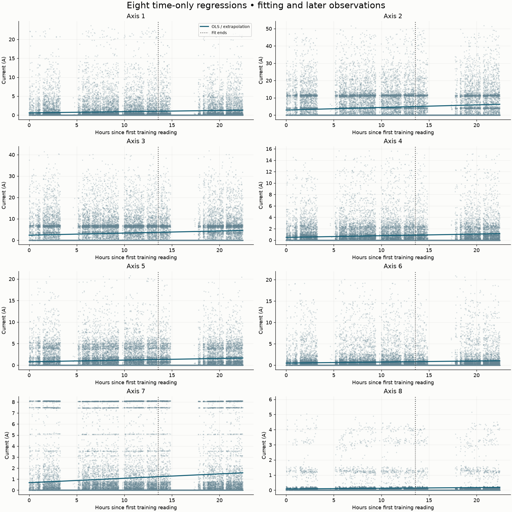
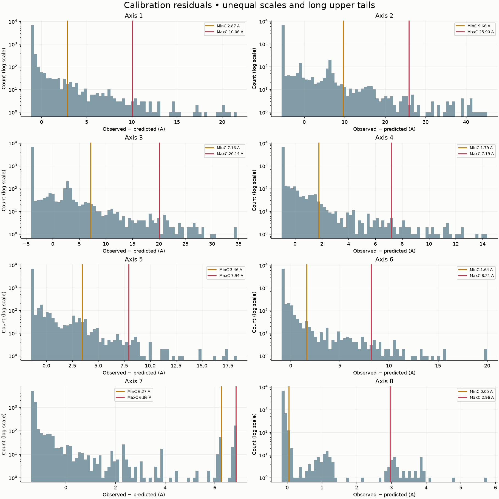
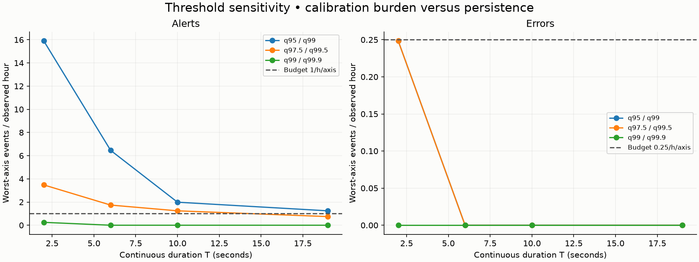
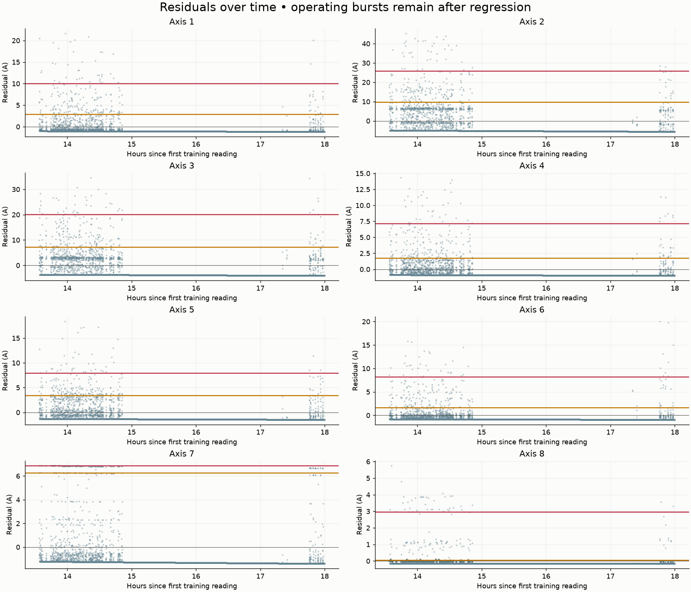
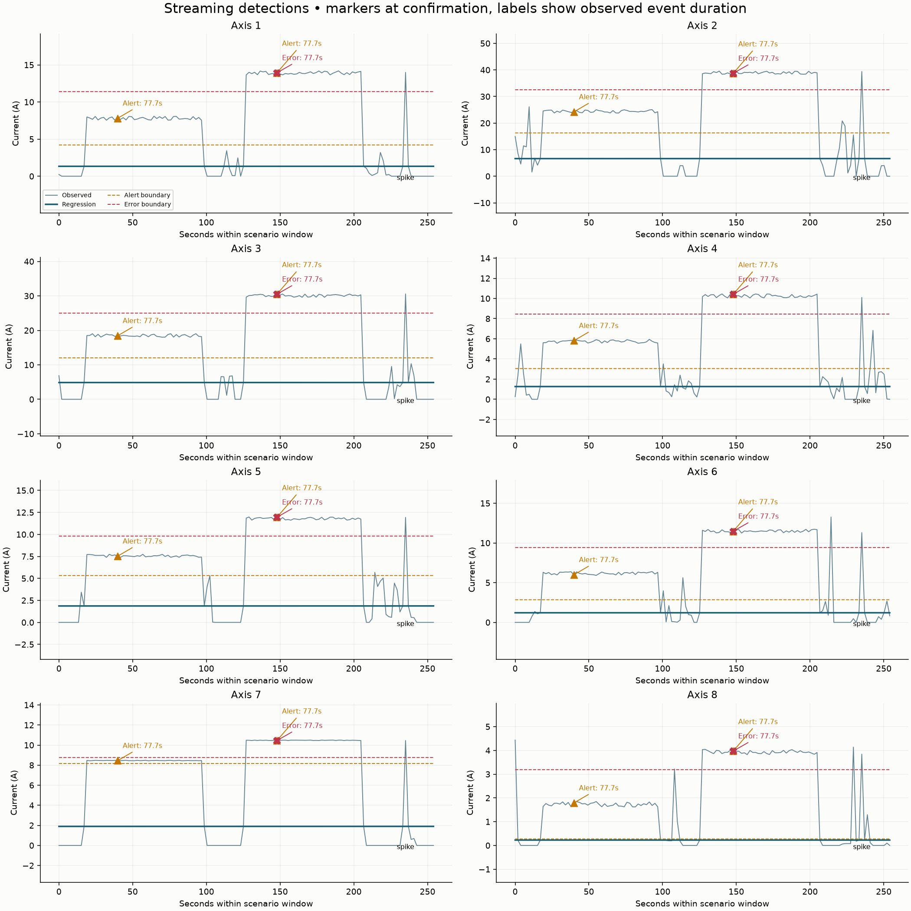

# Linear Regression and Maintenance Alerts

This project explores predictive-maintenance alerts for an eight-axis Kawasaki materials-handling robot. It fits a separate time-based linear regression model to each axis's current readings, then looks for sustained positive deviations from those predictions. The workflow combines historical Neon PostgreSQL data, synthetic alert scenarios, saved analysis results, and a short database-backed streaming demonstration.

## Results at a Glance

- The source CSV contains **39,672 readings** collected from 2022-10-17 to 2022-10-18, over about **22.4 hours**, at a median interval of **1.896 seconds**.
- The robot is fully idle in **64.2%** of rows. The source export has columns for 14 axes, but only axes 1–8 contain readings.
- The notebook verifies the canonical Neon rows against the supplied CSV, then splits them by time: **23,803 fit**, **7,934 calibration**, and **7,935 holdout** rows.
- The eight time-only regression models have very low fit $R^2$ values (about 0.002–0.007); holdout $R^2$ is negative for all axes. They are weak current forecasts, so the project uses them as a baseline for studying residual-based alert rules, not as a reliable production predictor.
- The selected rule uses the 97.5th and 99.5th percentiles of calibration residuals, with **19 seconds of persistence**. It generated no sustained Alert or Error events on the later holdout segment.
- Synthetic evaluation detected **all 16 of 16** injected sustained Alert and Error patterns and ignored **all 8 of 8** isolated spikes. Detected events were reported after about **20.9 seconds**, including sampling cadence after the configured 19-second persistence period.
- The optional Neon stream demo inserted and queried back **240 of 240** synthetic readings, verified their raw and scaled values, and left the historical training table unchanged. The notebook also checks that the existing Dash layout responds successfully.
- The dataset has no confirmed failure labels and spans only one day. The results demonstrate rule behavior; they do not establish real-world fault prediction accuracy.

## Repository Layout

```text
.
├── DataStreamVisualization_Workshop.ipynb  # earlier streaming and dashboard workshop
├── LinearRegression_with_Alerts.ipynb      # regression, alert analysis, synthetic tests, stream demo
├── data/
│   ├── RMBR4-2_export_test.csv              # 39,672 original robot readings
│   ├── synthetic_ground_truth.csv           # synthetic scenario labels
│   ├── synthetic_normal.csv                 # baseline-like test stream
│   ├── synthetic_stress.csv                 # injected stress test stream
│   └── *_normalized.csv / *_standardized.csv# scaled synthetic views
├── results/
│   ├── plots/                               # regression, residual, threshold, alert plots
│   ├── regression_metrics.csv               # fit/calibration/holdout model metrics
│   ├── thresholds.csv                       # selected per-axis alert/error limits
│   ├── calibration_events.csv               # events found during threshold tuning
│   ├── holdout_events.csv                    # events found on later real readings
│   ├── synthetic_*_events.csv                # synthetic event logs
│   ├── synthetic_evaluation.csv               # expected-versus-detected scenarios
│   ├── stream_predictions.csv                # local stream predictions and residuals
│   ├── cloud_stream_*.csv                    # optional Neon stream-demo outputs
│   └── run_metadata.json                     # dataset, split, and run provenance
├── src/
│   ├── data_collection/
│   │   ├── data_collection_agent.py          # Neon connections and data access
│   │   └── streaming_simulator.py             # CSV replay and synthetic stream table
│   ├── database-service/
│   │   └── migrate_schema.py                  # staged robot_readings table migration
│   └── web_ui/                                # shared axis definitions and Dash dashboard
├── pyproject.toml
└── requirements.txt
```

## Setup

Requires **Python 3.13 or newer**, a Neon PostgreSQL database, and access to the canonical `robot_readings` table. Run commands from the repository root; the notebook and data-access code resolve files and `.env` relative to it.

### Install dependencies

With [uv](https://docs.astral.sh/uv/):

```bash
uv sync
uv run jupyter lab
```

Or with pip:

```bash
python3.13 -m venv .venv
source .venv/bin/activate       # Windows: .venv\Scripts\activate
pip install -r requirements.txt
jupyter lab
```

Open `LinearRegression_with_Alerts.ipynb` and run the cells from top to bottom. The first analysis section requires a reachable Neon database and a `robot_readings` table containing the canonical CSV snapshot. The notebook verifies the table's rows against `data/RMBR4-2_export_test.csv` before fitting any models.

Create a `.env` file in the repository root with the database connection string:

```text
DATABASE_URL=postgresql://<user>:<password>@<host>/<database>?sslmode=require
```

Keep credentials private; never commit `.env` or an archive containing it. If the course requires submitting database configuration, send it only through the instructor-approved channel. If email is required, use a password-protected archive and communicate its password separately. 
The default notebook run writes 240 synthetic readings to the separate `pm_lab_scaled_stream` table for its streaming demonstration. Set `PM_CLOUD_DEMO=0` in `.env` to skip only that write-and-query demo; historical model training still requires Neon. `PM_REPLAY_SPEED=20` controls the requested replay pause relative to the source cadence; `1` requests the original cadence. Database and chart processing add wall-clock time.


## How It Works

1. **Load and validate history.** The notebook reads the canonical 8-axis current data from Neon, compares it with the supplied CSV, checks timestamps and values, and sorts readings chronologically. Zero-current rows are retained because they represent idle time.
2. **Split by time.** The earliest 60% fits the models, the next 20% calibrates thresholds, and the final 20% is held back for evaluation. The holdout data does not determine either model coefficients or alert limits.
3. **Fit per-axis models.** Each axis gets a separate ordinary least-squares linear model using elapsed time as its only input. Predictions provide an axis-specific baseline; residual is `actual current - predicted current` in amperes.
4. **Calibrate sustained-event rules.** Positive residual quantiles from the calibration segment set independent Alert and Error limits for each axis. Candidate quantile pairs and persistence periods are compared against calibration event-rate targets.
5. **Evaluate.** The chosen rules are applied to the real holdout and to deterministic synthetic normal/stress scenarios, including sustained increases and isolated spikes. Tables and plots are written to `results/`.
6. **Demonstrate streaming.** When enabled, synthetic readings are scaled using values derived from the verified Neon training data, written to `pm_lab_scaled_stream`, and queried back. The notebook verifies all 240 records and their raw/scaled values, then reuses the existing live-chart helpers to create `results/workshop_current_chart.html`. It also checks the existing Dash app's layout endpoint without launching a server. The original `robot_readings` history is not modified by this demo.

## Alert and Error Rules

The model residual is the difference between measured and predicted current. Only **positive** residual excursions are considered: lower-than-predicted current does not trigger these rules.

| Rule | Meaning |
|---|---|
| **Alert** | Residual reaches or exceeds the axis-specific `MinC_A` limit continuously for at least 19 seconds. |
| **Error** | Residual reaches or exceeds the higher axis-specific `MaxC_A` limit continuously for at least 19 seconds. |
| **Gap reset** | A sampling gap longer than 3.0105 seconds breaks the excursion; missing samples are not treated as evidence that high current persisted. |
| **Spike handling** | A short, isolated high reading is not enough to create a sustained event. |

`MinC_A` and `MaxC_A` are residuals above the regression prediction, not absolute current limits. The selected limits are axis-specific:

| Axis | Alert `MinC_A` (A) | Error `MaxC_A` (A) |
|---|---:|---:|
| 1 | 2.868 | 10.058 |
| 2 | 9.658 | 25.897 |
| 3 | 7.159 | 20.141 |
| 4 | 1.786 | 7.187 |
| 5 | 3.457 | 7.944 |
| 6 | 1.640 | 8.211 |
| 7 | 6.267 | 6.861 |
| 8 | 0.048 | 2.963 |

Threshold selection compared 95/99, 97.5/99.5, and 99/99.9 residual-percentile pairs across several persistence durations. The chosen 97.5/99.5 pair with 19 seconds met the notebook's calibration targets of no more than 1 Alert per hour and 0.25 Errors per hour on any axis. These are lab tuning targets, not operational service-level guarantees. An Alert or Error is a signal for investigation, not proof of component failure.

## Plots

The notebook regenerates these PNGs under `results/plots/`. When the cloud stream demo is enabled, it also writes the interactive chart to `results/workshop_current_chart.html`.

**Per-axis regression fits and later observations**



**Calibration residual distributions and chosen limits**



**Threshold sensitivity and calibration event-rate budget**



**Residuals over time with Alert and Error boundaries**



**Synthetic alert/error scenario overlays**



## Limitations

- **Very short history:** the source covers about 22.4 hours, not weeks or months. It cannot establish a wear trend or validate early warning for the torque-tube failure described by the project use case.
- **Weak time-only fit:** current depends on robot activity and workload, not simply time. The low fit scores and negative holdout $R^2$ show that these lines should not be interpreted as accurate current forecasts.
- **No labeled failures:** there is no ground truth for actual faults. Calibration event counts and synthetic tests measure rule behavior, not real-world precision, recall, or false-alarm rate.
- **Idle versus stopped production:** 64.2% of rows are fully idle, and a multi-hour production pause appears in the data. Current alone cannot reliably distinguish a healthy idle robot from an unavailable production line.
- **Synthetic data is an empirical test fixture:** it is derived from reordered training blocks and injected changes, not independent real-world operation or a confirmed failure record.
- **Current is not energy:** the dataset contains current in amperes only. Voltage, phase, power factor, and other conversion inputs are unavailable, so energy consumption in kWh is not calculated.
- **Database dependency:** model training currently reads Neon rather than running from the CSV alone. Credentials, network access, and the expected canonical table are required for a complete notebook run.
